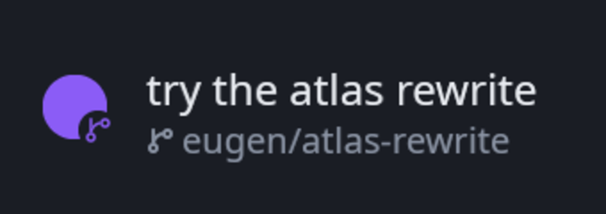
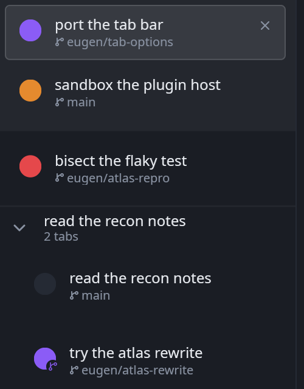

# Worktree

A mark on every [Crook](https://github.com/theguriev/crook) tab whose directory is a linked git
worktree — as a plugin the terminal does not carry.



A worktree is a second checkout of one repository, on a branch of its own, in a directory of
its own. Crook opens one beside the tab that asked for it and folds the two into a group — but
a group says "these two belong together", not "this one is the copy", and coming back to a
window of eight tabs there is no way to tell which are worktrees. This says it:



It is deliberately **not** about how the tab was opened. A worktree you made at a shell three
years ago gets the mark, and so does the one Crook made this morning, because what the mark
means is "this directory is a worktree" — a fact about the directory, which is the only thing
anybody can act on.

## What it is allowed to do

One thing: **see which project each tab is in**. That is the sentence the permission dialog
says, and it is `Capability::ReadWorkingDirectory`.

| It wants to | Because |
| --- | --- |
| See which project each tab is in | It is the only way to answer the one question this plugin exists to answer. What crosses the boundary per row is the directory, the branch, and whether that directory is a worktree — and the plugin reads the third of those and nothing else. |

Nothing else is asked for and nothing else is reachable: a sandboxed plugin has no filesystem,
no network, no clock and no thread. It cannot read the files in that directory, run git, or
find out what any of your agents are doing.

**Until you allow it, it draws nothing.** Not an error and not a refusal — the host hands it
each row with the directory left out, and a row this plugin cannot see the directory of is a
row it has nothing to say about. It says so once in the log, and then it is quiet.

## Install

Download `plugin.wasm` from the [latest release](https://github.com/theguriev/crook-worktree/releases/latest)
and put it where Crook looks:

```sh
crook --install-plugin plugin.wasm
```

Or by hand, which is the same thing:

```sh
mkdir -p ~/.local/share/crook/plugins/theguriev.worktree
cp plugin.wasm ~/.local/share/crook/plugins/theguriev.worktree/
```

On macOS that directory is `~/Library/Application Support/crook/plugins/`, and on Windows
`%APPDATA%\crook\plugins\`. Then start Crook, open **Settings → Plugins**, select **Worktree**,
and allow the one thing it asks for. Answering rebuilds it there and then; there is nothing to
restart.

## How it works

Crook's tab panel reserves 24 pixels at the head of every row, and the small badge on the
bottom-right corner of that box is a slot of its own — `tab.row.badge`, declared by the
terminal's own `crook/tabs` plugin. This plugin takes it, and answers with an icon *by name*:
`git-branch`, in the theme's accent tone. The artwork is Crook's, the size is Crook's, and the
ring that separates the badge from whatever it sits on is Crook's — this plugin cannot draw a
pixel of its own, which is why it looks right in a theme written years after it.

A contribution to a row slot may **decline** a row, and that is the whole mechanism here: on
every row that is not a worktree this plugin answers with nothing, and "nothing" means the row
is drawn exactly as it would have been. So it composes with a plugin that draws the mark
underneath it — [crook-emoji](https://github.com/theguriev/crook-emoji), say — rather than
competing with it.

Whether a directory is a worktree is the host's answer, not a guess: git keeps a linked
worktree's `HEAD` in `<main>/.git/worktrees/<name>` and shares everything else, so its git
directory is not its common directory. A submodule, which also has a git directory in an
unexpected place, is not a worktree and does not get the mark.

## Building it

```sh
cargo test --workspace
cargo build --release --target wasm32-unknown-unknown
cp target/wasm32-unknown-unknown/release/worktree.wasm plugin.wasm
```

`crook_plugin_api` is the published crate from crates.io, not a copy. It is versioned
`0.<abi>.<patch>`, so the `0.8` in `Cargo.toml` is plugin API 8, and moving this plugin to a new
API is changing that one number. `ABI_VERSION` is compiled into the module from it, and a Crook
that speaks another number — older or newer — refuses the plugin by number, at load, with a line
saying which version each side speaks.

Everything except `sys.rs` builds for the host, which is why `cargo test` runs the part that
decides anything without a terminal to install a plugin into.

## Releasing

A release is a tag, and the tag is cut by a script:

```sh
./script/release 0.1.1 --push
```

It sets the version in `Cargo.toml`, writes the `## v0.1.1` section of `CHANGELOG.md`
from the commit titles since the previous tag with
[changelogen](https://github.com/unjs/changelogen), commits both as `chore(release):
v0.1.1`, tags it and pushes. `ci.yml` builds `plugin.wasm` from that tag and puts it on a
release page whose notes are that same section — written once, not once for the file and
again for the page. `--dry-run` prints the section and stops; `--push` is what starts the
build.

Which makes commit titles the release notes, so they are [Conventional
Commits](https://www.conventionalcommits.org/en/v1.0.0/) — `feat(panel): …`, `fix: …`, the
types listed under `types` in `changelog.config.json`. A title in any other shape is not an
error to the generator, it is dropped without a word, so it is refused where it is still
easy to fix: `git config core.hooksPath script/hooks` installs the hook, and `commits.yml`
runs the same check on every pull request. The history before all this predates the convention,
so the first release over it needs `--allow-untyped`, which says the omission is understood.

## Licence

MIT.
